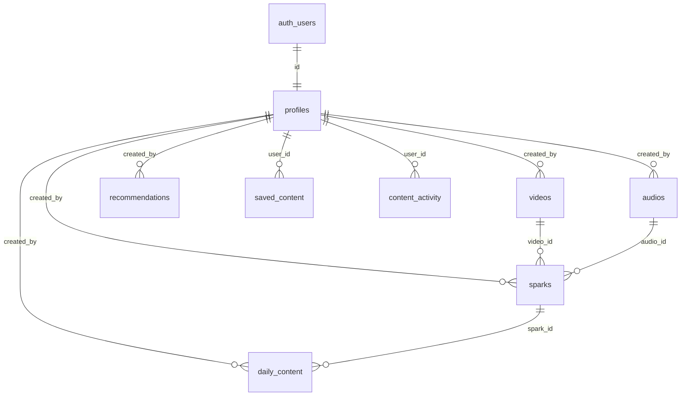

# Supabase Database & Storage Foundation Documentation
**Project:** Dr. Cubie Inspiration (`dr-cubie-inspiration`)  
**Target:** Supabase PostgreSQL & Storage

---

## 1. Overview & Architecture

The backend architecture is structured around two distinct operational domains:

```
                            ADMIN (Future Dashboard)
                                       │
                                       ▼
                             SUPABASE BACKEND
                     ┌─────────────────┴─────────────────┐
                     │                                   │
                 PostgreSQL                           Storage
                     │                                   │
              ┌──────┴──────┐                  ┌─────────┴─────────┐
              ▼             ▼                  ▼                   ▼
        Global / Common  User-Specific   Admin Media        User Media
          (Read-Only     (Isolated RLS)  (Videos, Audio,    (Avatars)
           for Users)                     Thumbnails)
```

1. **Global / Common Content:** Created, curated, and managed by Admins; viewable by all authenticated users (and public where published).
2. **User-Specific Data:** Strictly isolated per user (`auth.uid() = user_id`) using Row Level Security (RLS).
3. **Storage Assets:** Managed in dedicated buckets with separated write permissions.

---

## 2. Database Tables

### A. User Domain (User-Specific)

| Table | Purpose | Key Fields | RLS Isolation |
|---|---|---|---|
| `profiles` | Stores user profiles and permissions | `id (references auth.users)`, `full_name`, `email`, `avatar_url`, `role`, `is_vip`, `created_at`, `updated_at` | Read: Own profile only (`id = auth.uid()`) or Admin. Update: Own profile only (`id = auth.uid()`) or Admin. |
| `saved_content` | Saves Sparks, videos, or audio for individual users | `id`, `user_id (references profiles)`, `content_type` (`spark`/`video`/`audio`), `content_id`, `created_at` | Strict User Isolation: Users can only select/insert/delete their own rows (`user_id = auth.uid()`). Unique constraint on `(user_id, content_type, content_id)`. |
| `content_activity` | Tracks watch history, audio progress, and completion | `id`, `user_id (references profiles)`, `content_type`, `content_id`, `progress`, `completed`, `last_played_at`, `created_at`, `updated_at` | Strict User Isolation: Users can only read/write their own records (`user_id = auth.uid()`). Unique constraint on `(user_id, content_type, content_id)`. |

### B. Global / Common Content Domain (Admin-Controlled)

| Table | Purpose | Key Fields | RLS Isolation |
|---|---|---|---|
| `sparks` | Core daily wisdom modules, reflections, and practices | `id`, `slug`, `title`, `short_description`, `category`, `duration`, `thumbnail_url`, `video_id`, `audio_id`, `reflection`, `insight`, `practice`, `status`, `is_vip`, `created_by` | Read: Any published item (`status = 'published'`). Write: Admin only (`role = 'admin'`). |
| `videos` | Video metadata and storage asset links | `id`, `title`, `description`, `video_url`, `thumbnail_url`, `duration`, `duration_seconds`, `category`, `is_vip`, `status`, `created_by` | Read: Published. Write: Admin only. |
| `audios` | Audio contemplations, soundscapes, and speaker info | `id`, `title`, `description`, `audio_url`, `duration`, `duration_seconds`, `category`, `speaker`, `thumbnail_url`, `is_vip`, `status`, `created_by` | Read: Published. Write: Admin only. |
| `daily_content` | Maps specific calendar dates to featured Sparks | `id`, `content_date` (unique date), `spark_id (references sparks)`, `status`, `created_by` | Read: Published. Write: Admin only. |
| `recommendations`| Admin-curated recommendations list for "Recommended For You" | `id`, `title`, `content_type` (`video`/`audio`/`spark`), `content_id`, `category`, `display_order`, `is_active`, `created_by` | Read: Active (`is_active = true`). Write: Admin only. |

---

## 3. Important Relationships



---

## 4. Role Structure & Authorization

- **User Roles (`profiles.role`):**
  - `'user'` (default): Can read published content, maintain their own profile, bookmark/save items, and record media activity.
  - `'admin'`: Can publish, edit, draft, archive content, manage recommendations, and schedule daily sparks.
- **Helper Function:**
  ```sql
  public.is_admin()
  ```
  Returns `true` if `auth.uid()` corresponds to a profile with `role = 'admin'`. Used across all RLS policies.
- **Auto Profile Creation:** Trigger `on_auth_user_created` on `auth.users` automatically inserts a corresponding row into `public.profiles` upon user sign-up.

---

## 5. Storage Buckets & Policies

| Bucket | Purpose | Public | Max File Size | Allowed MIME Types | Upload Permission |
|---|---|---|---|---|---|
| `videos` | Video assets for Sparks and Keynotes | Yes | 100 MB | `video/mp4`, `video/webm`, `video/quicktime` | Admins only |
| `audio` | Guided contemplation sound files | Yes | 50 MB | `audio/mpeg`, `audio/mp3`, `audio/wav`, `audio/aac`, `audio/ogg` | Admins only |
| `thumbnails` | Spark posters and recommendation cards | Yes | 10 MB | `image/jpeg`, `image/png`, `image/webp`, `image/svg+xml` | Admins only |
| `avatars` | User profile avatar uploads | Yes | 5 MB | `image/jpeg`, `image/png`, `image/webp` | Authenticated user (`avatars/{userId}/*`) or Admin |

### Storage Folder Conventions
```
videos/
  sparks/
  vip/

audio/
  sparks/
  vip/

thumbnails/
  sparks/
  recommendations/

avatars/
  {userId}/avatar.jpg
```

---

## 6. How to Apply the Schema

1. Open your [Supabase Dashboard](https://supabase.com/dashboard).
2. Select your project **dr-cubie-inspiration**.
3. Navigate to **SQL Editor** → **New Query**.
4. Copy the entire contents of [`supabase/schema.sql`](file:///c:/Users/Uxdlab/Documents/GitHub/drcubie-app/supabase/schema.sql).
5. Click **Run**.
6. The database tables, triggers, RLS policies, and storage buckets will be instantly initialized.

---

## 7. Status & Existing App Compatibility

- The React application (`App.jsx`, `Today`, `Saved`, `VipPass`, `Profile`, `AudioContext`, etc.) remains 100% functional on the existing dummy data.
- No frontend components, styles, or routes have been modified.
- Ready for Phase 3: Auth UI, dynamic Supabase data fetching, and Admin Dashboard.
